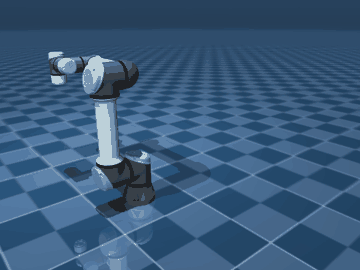
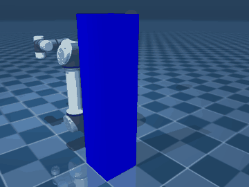
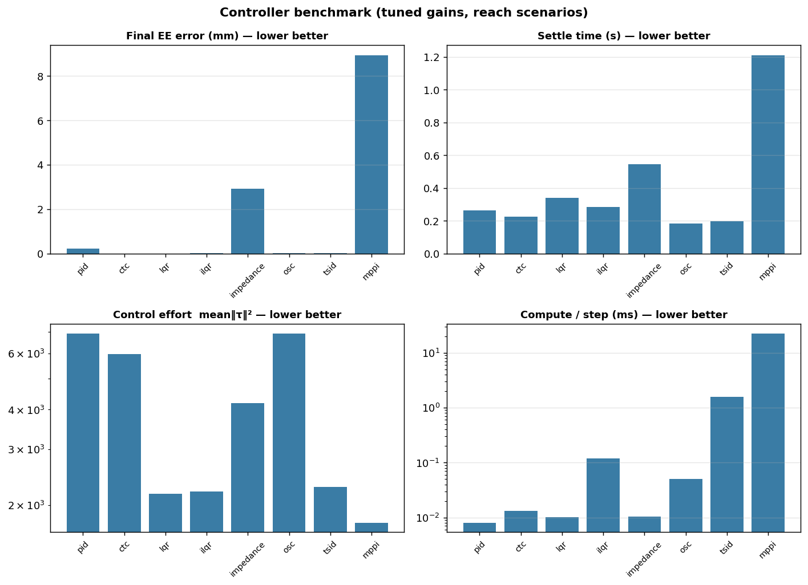

<div align="center">

# 🦾 manipdyn — 6-DOF Manipulator Planning & Control Lab

**A MuJoCo-physics lab for the UR5e: a benchmarked zoo of 8 controllers and 5 motion planners, with trajectory optimization, automatic gain tuning, a reinforcement-learning baseline, an interactive control center, and a full pick-and-place — all behind one clean, tested, documented package.**


<br/>



<sub>Pick-and-place (top); operational-space reach and RRT-Connect obstacle avoidance (bottom) — all rendered headlessly by the library.</sub>

</div>

---

## Why this project

Most manipulator demos show *one* method doing *one* thing. **manipdyn implements
the classical and modern methods behind a single uniform interface, then
*measures* them against each other** on identical, reproducible, fairly-tuned
scenarios — answering *which method wins, and when*, with data instead of
adjectives.

## Highlights

| Area | What's included |
|------|-----------------|
| **Control (8)** | PID · Computed-Torque · LQR · **iLQR** · Cartesian Impedance · OSC · **TSID (constrained QP)** · **MPPI** |
| **Planning (5)** | RRT · **RRT-Connect** · RRT\* · **Informed RRT\*** · PRM (+ collision checking, shortcut & B-spline smoothing) |
| **Optimization** | iLQR trajectory optimization · time-optimal path parameterization (TOPP) · **black-box controller auto-tuning** |
| **Learning** | a Gymnasium reach env + an **SAC** baseline, scored against the classical controllers |
| **Benchmark** | one command → metrics table + comparison plots, with fair auto-tuned gains |
| **Tasks** | a complete **pick-and-place** (grasp → base-rotation carry → stable place) |
| **GUI** | a PySide6 control center with an embedded live 3D view, per-controller gains, planner integration, and live telemetry |
| **Engineering** | installable package · typed interfaces · `pytest` suite · headless rendering · ruff · GitHub Actions CI |

## Quickstart

```bash
cd manipdyn
pip install -e ".[gui,rl]"          # core + GUI + reinforcement learning

manipdyn bench                      # run the benchmark -> benchmarks/results/
manipdyn gui                        # launch the control center
python scripts/make_pick_place.py   # render the pick-and-place demo
```

```python
import numpy as np
from manipdyn.sim import World
from manipdyn.control import Target
from manipdyn.tuning import tuned_controller

world = World(scene="scene_base")
ctrl = tuned_controller("ctc", world)          # computed-torque, tuned gains
goal = np.array([1.0, -1.1, 1.2, -1.6, -1.4, 0.4])
for _ in range(1500):
    world.step(ctrl.compute(Target(q=goal)))
print("final joint error:", np.linalg.norm(goal - world.qpos_arm))
```

## Benchmark results

Reach scenarios on the UR5e, **tuned gains**, scored by end-effector error.
Regenerate any time with `manipdyn bench`.

| controller | final err | settle | effort ‖τ‖² | compute |
|------------|----------:|-------:|------------:|--------:|
| computed-torque | **8e-10 mm** | 0.23 s | 6.0e3 | 0.013 ms |
| lqr | 2e-5 mm | 0.34 s | 2.2e3 | 0.010 ms |
| osc | 0.008 mm | **0.18 s** | 6.9e3 | 0.05 ms |
| tsid | 0.025 mm | 0.20 s | 2.3e3 | 1.57 ms |
| ilqr | 0.01 mm | 0.29 s | 2.2e3 | 0.12 ms |
| pid | 0.23 mm | 0.26 s | 6.9e3 | **0.008 ms** |
| impedance | 2.93 mm | 0.55 s | 4.2e3 | 0.010 ms |
| mppi | 8.95 mm | 1.21 s | **1.8e3** | 22.5 ms |



Auto-tuning (global search + Nelder-Mead polish) cut controller cost **41–65%**
vs. hand-picked defaults. The SAC policy reaches **80%** of random goals to
within 3 cm on the same physics. Full tables and the math behind every method
live in [`manipdyn/docs/`](manipdyn/docs/).

## Repository layout

```
manipdyn/            ← the project (v2): installable package, benchmark, GUI, docs, demos
code/                ← v1 origin story: a clean pure-NumPy trajectory simulator
Manipulator Test/    ← the first MuJoCo experiment that seeded the rewrite
```

> **`manipdyn/` is the project.** `code/` and `Manipulator Test/` are preserved
> unchanged as the "origin story" — a pure-NumPy 6-DOF simulator and a first
> MuJoCo prototype that this rewrite turns into a clean, tested, benchmarked,
> documented package. See **[`manipdyn/README.md`](manipdyn/README.md)** for the
> full package documentation.

## Attribution & license

`manipdyn` source is **MIT** (see [LICENSE](LICENSE)). The UR5e model is derived
from the [MuJoCo Menagerie](https://github.com/google-deepmind/mujoco_menagerie)
/ ROS-Industrial UR5e description and is **BSD-3-Clause** (see its bundled
`LICENSE` under `manipdyn/src/manipdyn/models/ur5e_model/`).
