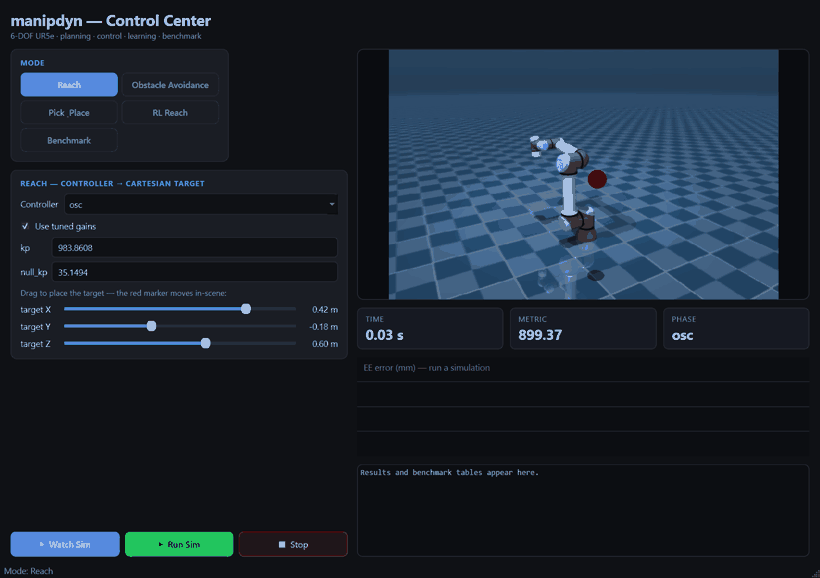

# manipdyn

**A MuJoCo-physics lab for 6-DOF manipulator planning and control** — a benchmarked zoo of 8 controllers and 5 motion planners on the UR5e, with trajectory optimization, automatic gain tuning, a reinforcement-learning baseline, and an interactive control center.

[](https://github.com/Manas-arumalla/manipdyn/actions/workflows/ci.yml)


<p float="left">
  
</p>
<p float="left">
  
  
</p>

> **Top:** a full pick-and-place — cube picked off one table, carried by a base rotation, and placed on another — built from a top-down grasp solver, time-optimal trajectories, and computed-torque control. **Bottom:** operational-space control reaching a target (left); an RRT-Connect plan, time-parameterized and tracked with computed-torque control around an obstacle (right). All rendered headlessly by the library.

---

## Why I built this

I wanted one place to implement the classical and modern manipulator methods
behind a single interface and compare them fairly, on identical and
reproducible scenarios, instead of judging each one from a separate demo.

## Features

| Area | What's included |
|------|-----------------|
| **Control** | PID · Computed-Torque · LQR · **iLQR** · Cartesian Impedance · OSC · **TSID (QP, constrained)** · **MPPI** |
| **Planning** | RRT · **RRT-Connect** · RRT\* · **Informed RRT\*** · PRM, with collision checking + shortcut/B-spline smoothing |
| **Optimization** | iLQR trajectory optimization · time-optimal path parameterization (TOPP) · **black-box controller auto-tuning** |
| **Task planning** | a symbolic **STRIPS** layer turning declarative goals into pick/place/stack sequences |
| **Learning** | Gymnasium reaching envs + an **SAC** baseline (state- and vision-conditioned), compared against the classical controllers |
| **Perception** | a simulated **RGB-D camera** → point cloud → object-pose estimate that drives the grasp from vision instead of ground-truth state; multi-object/clutter |
| **Parametric** | procedural scene generation with **MjSpec** (random N-cube clutter, deterministic per seed) for domain randomization; a **RobotSpec** de-hardcodes the arm |
| **Multi-robot** | two UR5e arms in **one shared sim**, independently controlled; a two-arm **cube handover** |
| **Benchmark** | one command → metrics table + comparison plots, with **fair, auto-tuned gains** |
| **GUI** | a mode-based PySide6 control center — Watch Sim (interactive MuJoCo viewer + live telemetry) or Run Sim (headless results) across every mode |
| **Engineering** | installable package, typed interfaces, `pytest` suite, headless rendering, ruff, GitHub Actions CI |

## Quickstart

```bash
pip install -e ./manipdyn            # core
pip install -e "./manipdyn[gui,rl]"  # + GUI + reinforcement learning
```

```python
import numpy as np
from manipdyn.sim import World
from manipdyn.control import Target
from manipdyn.tuning import tuned_controller

world = World(scene="scene_base")
ctrl = tuned_controller("ctc", world)          # computed-torque, tuned gains
goal = np.array([1.0, -1.1, 1.2, -1.6, -1.4, 0.4])
for _ in range(1500):
    world.step(ctrl.compute(Target(q=goal)))
print("final joint error:", np.linalg.norm(goal - world.qpos_arm))
```

```bash
manipdyn bench        # run the full benchmark -> benchmarks/results/
manipdyn demo         # headless PID demo, records a GIF
manipdyn gui          # launch the control center
```

## Benchmark results

Every method is scored on the **same** auto-tuned scenarios. Regenerate the whole
table with `manipdyn bench`.

**Controllers** — three reach targets on `scene_base`, tuned gains, scored by
end-effector error:

| controller | success | final err | settle | RMSE¹ | effort ‖τ‖² | compute |
|------------|:-------:|----------:|-------:|------:|------------:|--------:|
| computed-torque | 3/3 | **8e-13 mm** | 0.23 s | 72 mm | 6.0e3 | 0.013 ms |
| lqr | 3/3 | 2e-8 mm | 0.34 s | 80 mm | 2.2e3 | 0.015 ms |
| osc | 3/3 | 0.008 mm | **0.18 s** | 67 mm | 6.9e3 | 0.054 ms |
| tsid | 3/3 | 0.025 mm | 0.20 s | **67 mm** | 2.3e3 | 1.41 ms |
| ilqr | 3/3 | 0.011 mm | 0.29 s | 75 mm | 2.2e3 | 0.13 ms |
| pid | 3/3 | 0.23 mm | 0.26 s | 74 mm | 6.9e3 | **0.008 ms** |
| impedance | 3/3 | 2.9 mm | 0.55 s | 71 mm | 4.2e3 | 0.013 ms |
| mppi | 2/3 | 13.2 mm | 2.12 s | 150 mm | **1.8e3** | 26.3 ms |

**Planners** — a blocked start/goal query on `scene_obstacle`; every planner
finds a collision-free detour:

| planner | success | plan time | path length |
|---------|:-------:|----------:|------------:|
| RRT | 5/5 | **12 ms** | 1.61 rad |
| RRT-Connect | 5/5 | 17 ms | 1.69 rad |
| RRT\* | 5/5 | 12.9 s | 1.57 rad |
| Informed RRT\* | 5/5 | 24.5 s | **1.42 rad** |
| PRM | 5/5 | 6.7 s | 5.32 rad |

<sub>¹ RMSE is over the whole reach (approach transient included), not the
steady-state error in the "final err" column.</sub>


Auto-tuning (global search + Nelder-Mead polish) cut controller cost by
**41–65%** vs. hand-picked defaults. On a genuinely blocked obstacle query, all
five planners find a detour — from fast feasible RRT / RRT-Connect (~20 ms) to
the asymptotically-optimal Informed RRT\* (shortest path). See [docs](docs/) for
the full tables and the math behind each method.

**Every method, simulated — not just charted** (`python scripts/make_gallery.py`):
all 8 controllers reaching the same target, and all 5 planners' paths executed
around the obstacle pillar.


**Learned baseline:** an SAC policy on the same physics reaches **80%** of
random goals to within 3 cm (mean final error **34 mm**) after 40k steps —
learned and model-based control on one bench. A second, **vision-conditioned**
policy reaches a cube whose position comes from the camera (75% over random
placements). See [docs/rl.md](docs/rl.md).

**Perception in the loop**: a simulated overhead RGB-D camera renders depth +
segmentation, deprojects to a world point cloud, and estimates the cube's grasp
pose — so the pick-and-place is driven by **vision, not ground-truth state**. On
randomized placements the perceived pose matches truth to **~0.2 mm** and grasps
**12/12**, same as the oracle. See [docs/perception.md](docs/perception.md).

_Left: the scene. Right: the overhead camera the grasp is planned from (red
marker = perceived grasp point)._ Rendered by `scripts/make_perception_demo.py`.


The pipeline itself (`python scripts/make_perception.py`) — overhead RGB, depth,
the eye-in-hand wrist view, and the deprojected point cloud with the estimate:


**Multi-robot** (`python scripts/make_handover.py`): two UR5e arms in one shared
simulation, independently controlled. The left arm picks a cube, hands it to the
right arm mid-air (a weld transfer), and the right arm places it — the arms are
attached with `MjSpec` under `left_`/`right_` name prefixes and driven per-arm
through the same `World` interface. See [docs/multi_robot.md](docs/multi_robot.md).


## Architecture

```
World (MuJoCo wrapper) ── state, M(q), J, bias, render
   ├── kinematics/  IKSolver            target_x  -> q
   ├── dynamics/    linearize()         (A, B) for LQR
   ├── trajopt/     ILQR                optimal torque trajectory + gains
   ├── trajectory/  parameterize_*      geometric path -> timed trajectory
   ├── control/     Controller(ABC)     Target    -> arm torque   (8 controllers)
   ├── tuning/      tune_controller     optimize gains (+ fair-benchmark presets)
   ├── planning/    Planner(ABC)        q_start, q_goal -> path    (5 planners)
   ├── benchmark/   harness + report    metrics table + plots
   ├── rl/          ReachEnv            Gymnasium env + SAC baseline
   └── gui/         control center      live 3D · gains · planner · telemetry
```

## Control center



Mode-based (Reach · Obstacle Avoidance · Pick & Place · RL Reach · Benchmark)
and library-backed (no subprocess/JSON). Each mode offers **Watch Sim** — the
interactive MuJoCo viewer plus an embedded live view and real-time telemetry —
or **Run Sim**, a headless evaluation that reports results and plots. See
[docs/gui.md](docs/gui.md).

## Earlier prototypes

[`../code/`](../code/) holds an earlier pure-NumPy trajectory simulator and
[`../Manipulator Test/`](../Manipulator%20Test/) an earlier MuJoCo prototype.

## Attribution & license

`manipdyn` source is **MIT**. The UR5e model under
`src/manipdyn/models/ur5e_model/` is derived from the
[MuJoCo Menagerie](https://github.com/google-deepmind/mujoco_menagerie) /
ROS-Industrial UR5e description and is **BSD-3-Clause** (see its `LICENSE`).
