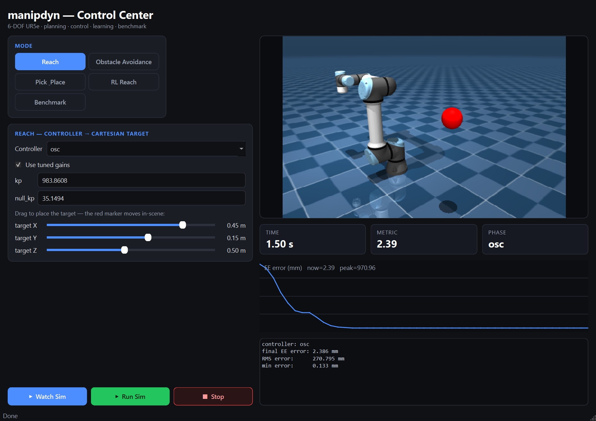

# manipdyn

**A MuJoCo-physics lab for 6-DOF manipulator planning and control** — a benchmarked zoo of 8 controllers and 5 motion planners on the UR5e, with trajectory optimization, automatic gain tuning, a reinforcement-learning baseline, and an interactive control center.


<p float="left">
  
</p>
<p float="left">
  
  
</p>

> **Top:** a full pick-and-place — top-down grasp, base-rotation transport, and a stable place — built from IK, the planner, time-optimal trajectories, and computed-torque control. **Bottom:** operational-space control reaching a target (left); an RRT-Connect plan, time-parameterized and tracked with computed-torque control around an obstacle (right). All rendered headlessly by the library.

---

## Why this exists

Most manipulator demos show *one* controller doing *one* thing. `manipdyn`
implements the classical and modern methods behind a **single uniform
interface**, then **measures** them against each other on identical,
reproducible scenarios — so the project answers *which method wins, and when*,
with data instead of adjectives.

## Features

| Area | What's included |
|------|-----------------|
| **Control** | PID · Computed-Torque · LQR · **iLQR** · Cartesian Impedance · OSC · **TSID (QP, constrained)** · **MPPI** |
| **Planning** | RRT · **RRT-Connect** · RRT\* · **Informed RRT\*** · PRM, with collision checking + shortcut/B-spline smoothing |
| **Optimization** | iLQR trajectory optimization · time-optimal path parameterization (TOPP) · **black-box controller auto-tuning** |
| **Learning** | a Gymnasium reaching env + an **SAC** baseline, compared against the classical controllers |
| **Benchmark** | one command → metrics table + comparison plots, with **fair, auto-tuned gains** |
| **GUI** | a PySide6 control center with an embedded live 3D view, per-controller gains, planner integration, and live telemetry |
| **Engineering** | installable package, typed interfaces, `pytest` suite, headless rendering, ruff, GitHub Actions CI |

## Quickstart

```bash
pip install -e ./manipdyn            # core
pip install -e "./manipdyn[gui,rl]"  # + GUI + reinforcement learning
```

```python
import numpy as np
from manipdyn.sim import World
from manipdyn.control import Target
from manipdyn.tuning import tuned_controller

world = World(scene="scene_base")
ctrl = tuned_controller("ctc", world)          # computed-torque, tuned gains
goal = np.array([1.0, -1.1, 1.2, -1.6, -1.4, 0.4])
for _ in range(1500):
    world.step(ctrl.compute(Target(q=goal)))
print("final joint error:", np.linalg.norm(goal - world.qpos_arm))
```

```bash
manipdyn bench        # run the full benchmark -> benchmarks/results/
manipdyn demo         # headless PID demo, records a GIF
manipdyn gui          # launch the control center
```

## Benchmark results

Reach scenarios on `scene_base`, **tuned gains**, scored by end-effector error.
Regenerate with `manipdyn bench`.

| controller | final err | settle | effort ‖τ‖² | compute |
|------------|----------:|-------:|------------:|--------:|
| computed-torque | **8e-10 mm** | 0.23 s | 6.0e3 | 0.013 ms |
| lqr | 2e-5 mm | 0.34 s | 2.2e3 | 0.010 ms |
| osc | 0.008 mm | **0.18 s** | 6.9e3 | 0.05 ms |
| tsid | 0.025 mm | 0.20 s | 2.3e3 | 1.57 ms |
| ilqr | 0.01 mm | 0.29 s | 2.2e3 | 0.12 ms |
| pid | 0.23 mm | 0.26 s | 6.9e3 | **0.008 ms** |
| impedance | 2.93 mm | 0.55 s | 4.2e3 | 0.010 ms |
| mppi | 8.95 mm | 1.21 s | **1.8e3** | 22.5 ms |


Auto-tuning (global search + Nelder-Mead polish) cut controller cost by
**41–65%** vs. hand-picked defaults; planners range from RRT-Connect (~1 ms) to
the asymptotically-optimal Informed RRT\*. See [docs](docs/) for the full tables
and the math behind each method.

**Learned baseline:** an SAC policy on the same physics reaches **80%** of
random goals to within 3 cm (mean final error **34 mm**) after 40k steps —
learned and model-based control on one bench. See [docs/rl.md](docs/rl.md).

## Architecture

```
World (MuJoCo wrapper) ── state, M(q), J, bias, render
   ├── kinematics/  IKSolver            target_x  -> q
   ├── dynamics/    linearize()         (A, B) for LQR
   ├── trajopt/     ILQR                optimal torque trajectory + gains
   ├── trajectory/  parameterize_*      geometric path -> timed trajectory
   ├── control/     Controller(ABC)     Target    -> arm torque   (8 controllers)
   ├── tuning/      tune_controller     optimize gains (+ fair-benchmark presets)
   ├── planning/    Planner(ABC)        q_start, q_goal -> path    (5 planners)
   ├── benchmark/   harness + report    metrics table + plots
   ├── rl/          ReachEnv            Gymnasium env + SAC baseline
   └── gui/         control center      live 3D · gains · planner · telemetry
```

## Control center



Library-backed (no subprocess/JSON), with an embedded live MuJoCo view,
per-controller gain fields, planner integration, and a real-time error plot.
See [docs/gui.md](docs/gui.md).

## Earlier prototypes

[`../code/`](../code/) holds an earlier pure-NumPy trajectory simulator and
[`../Manipulator Test/`](../Manipulator%20Test/) an earlier MuJoCo prototype.

## Attribution & license

`manipdyn` source is **MIT**. The UR5e model under
`src/manipdyn/models/ur5e_model/` is derived from the
[MuJoCo Menagerie](https://github.com/google-deepmind/mujoco_menagerie) /
ROS-Industrial UR5e description and is **BSD-3-Clause** (see its `LICENSE`).
