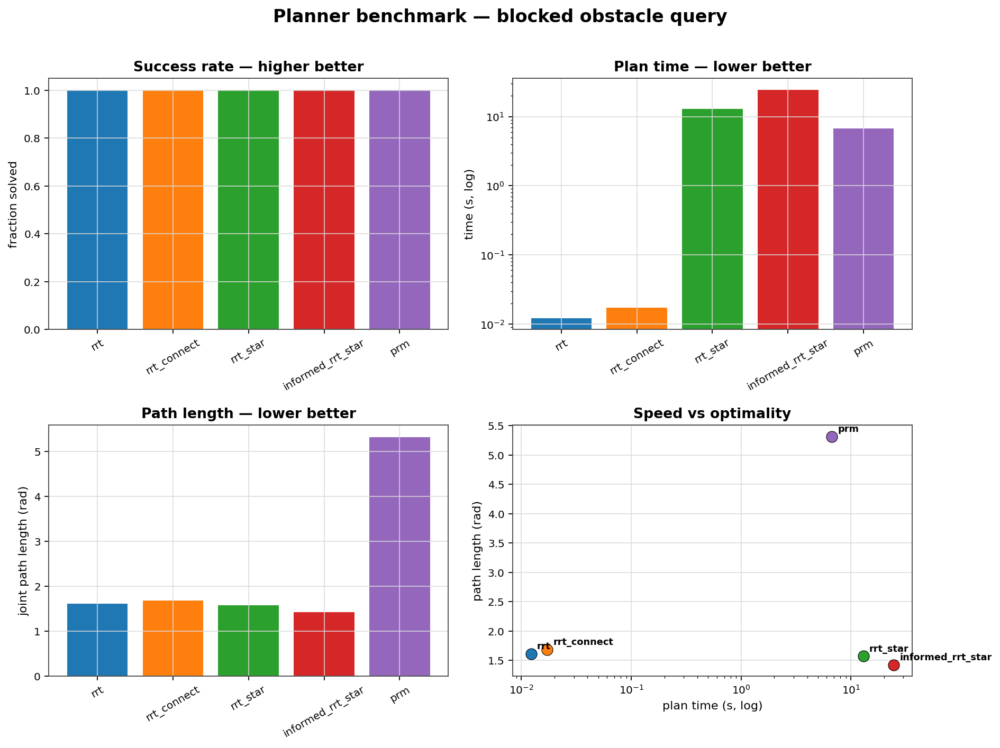

# manipdyn benchmark results

## Controllers

Reach scenarios on `scene_base`, tuned gains, scored by end-effector error toward the goal.

| controller | success_rate | final_err_mm | settle_s | rmse_mm | effort | peak_torque_nm | compute_ms |
| --- | --- | --- | --- | --- | --- | --- | --- |
| pid | 1 | 0.229 | 0.261 | 73.7 | 6.94e+03 | 875 | 7.73e-03 |
| ctc | 1 | 8.20e-13 | 0.225 | 71.6 | 5.97e+03 | 523 | 0.0132 |
| lqr | 1 | 1.82e-08 | 0.34 | 80.4 | 2.17e+03 | 352 | 0.0152 |
| ilqr | 1 | 0.0105 | 0.285 | 75 | 2.21e+03 | 220 | 0.132 |
| impedance | 1 | 2.93 | 0.546 | 71.1 | 4.19e+03 | 486 | 0.0131 |
| osc | 1 | 7.99e-03 | 0.182 | 67.3 | 6.93e+03 | 797 | 0.0541 |
| tsid | 1 | 0.0246 | 0.196 | 66.6 | 2.28e+03 | 233 | 1.41 |
| mppi | 0.667 | 13.2 | 2.12 | 150 | 1.76e+03 | 76 | 26.3 |

## Planners

Start→goal queries in an obstacle scene, averaged over seeds.

| planner | success_rate | plan_time_s | path_len_rad | raw_nodes | collision_free |
| --- | --- | --- | --- | --- | --- |
| rrt | 1 | 0.0122 | 1.61 | 11.6 | True |
| rrt_connect | 1 | 0.0171 | 1.69 | 14.6 | True |
| rrt_star | 1 | 12.9 | 1.57 | 6.2 | True |
| informed_rrt_star | 1 | 24.5 | 1.42 | 5.4 | True |
| prm | 1 | 6.7 | 5.32 | 3.8 | True |

