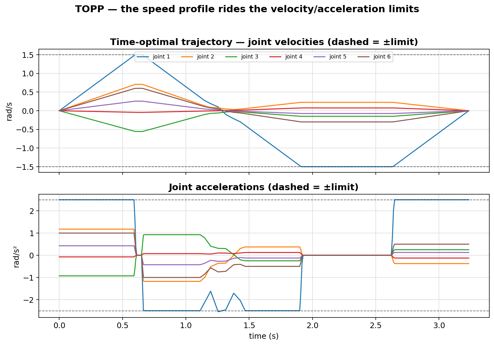
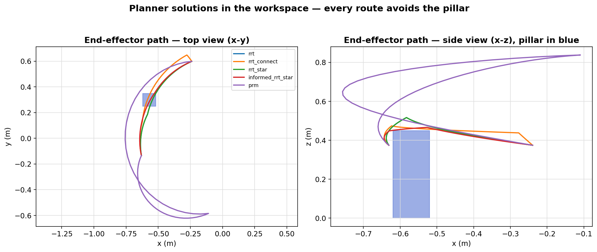
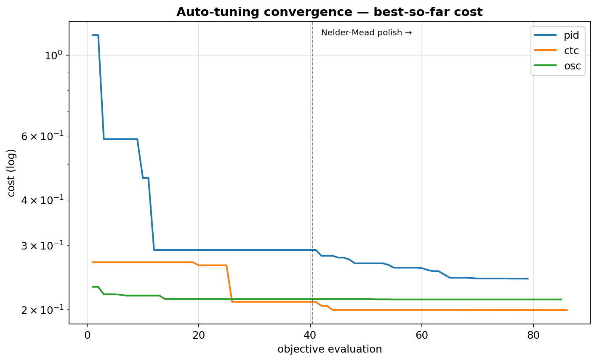
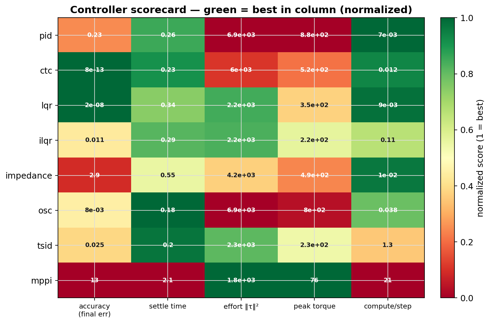

# Deeper analysis

Beyond the headline benchmark tables, these figures show *how* the methods
behave. Regenerate them with:

```bash
python scripts/make_analysis.py     # -> benchmarks/results/*.png
```

## Time-optimal trajectories (TOPP)



The forward–backward time parameterization produces a **bang-bang** speed
profile: each joint's velocity and acceleration ride their limits (dashed lines)
wherever they can. Sitting on a constraint is exactly what makes the timing
*optimal* — any faster would violate a limit. See
[time-optimal parameterization](theory/optimization.md).

## Planner solutions in the workspace



The same start/goal solved by all five planners, drawn as **end-effector paths**
in top (x-y) and side (x-z) views with the pillar shaded. RRT, RRT-Connect,
RRT\* and Informed RRT\* take a tight detour just past the pillar; **PRM**'s
uniformly-sampled roadmap routes a much wider, higher loop (lifting the
end-effector to ~0.84 m) — the narrow-passage effect that makes its path longer
even though it is collision-free. See [planning](theory/planning.md).

## Auto-tuning convergence



Best-so-far cost during gain optimization. A global search drops the cost
quickly, then a bounded **Nelder-Mead polish** (dashed line) refines the best
candidate — the procedure that produces the tuned-gain presets used everywhere
in the benchmark. See [optimization](theory/optimization.md).

## Controller scorecard



Every controller across five criteria, each normalized so **green is the column
winner**. No method wins everything, which is the point of the zoo:
computed-torque and LQR own accuracy, OSC and TSID settle fastest, MPPI uses the
least torque, and PID is the cheapest to compute. See the full numbers in
[the benchmark](theory/benchmark.md).
