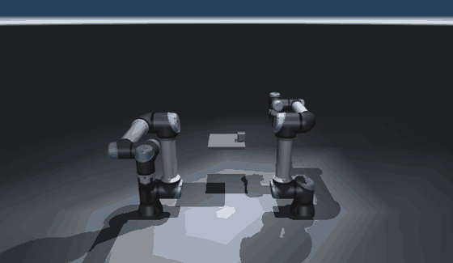

# Multi-robot

Two UR5e arms can run in **one shared simulation**, each independently
controlled — built on the `RobotSpec` abstraction and `mujoco.MjSpec`.



_Left arm picks the cube, hands it to the right arm mid-air (a weld transfer),
and the right arm places it on the table — two independently controlled arms in
one physics step._

## How it works

`mujoco.MjSpec` attaches two `ur5e_with_gripper` sub-models under `left_` /
`right_` **name prefixes**, so their joints/bodies/actuators don't clash.
`prefixed(UR5E, "left_")` gives each arm a namespaced `RobotSpec`, and two
`World`s share one `MjData` (via `World(..., data=other.data, home=False)`) so
they drive the *same* simulation — step once, after applying each arm's torque:

```python
from manipdyn.models.procedural import build_two_arm_scene, two_arm_worlds
from manipdyn.control import ComputedTorqueController, Target
import mujoco

model = build_two_arm_scene()
left, right = two_arm_worlds(model)        # share one sim
cl = ComputedTorqueController(left)
cr = ComputedTorqueController(right)

for _ in range(1500):
    left.apply_arm_torque(cl.compute(Target(q=goal_left)))
    right.apply_arm_torque(cr.compute(Target(q=goal_right)))
    mujoco.mj_step(model, left.data)        # one shared step
```

Each existing controller and the IK solver work per-arm unchanged — they operate
through the `World` interface, which now points at one arm of the shared model.

## The handover (`scripts/make_handover.py`)

1. **Pick** — IK plans a top-down approach; the left arm descends and a weld
   (`left_grasp`, relative pose set at grasp time) holds the cube.
2. **Hand off** — the left arm carries the cube to a point reachable by both;
   the right arm arrives, `right_grasp` welds, `left_grasp` releases.
3. **Place** — the right arm lowers until the cube meets the table, then
   releases. The cube ends upright on the table.

The scene ships two weld equalities (`left_grasp`, `right_grasp`), inactive by
default, so the transfer is just a matter of toggling them.
