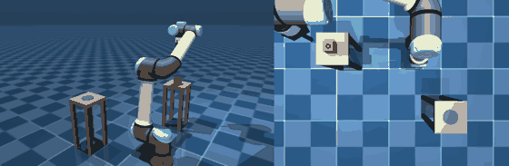
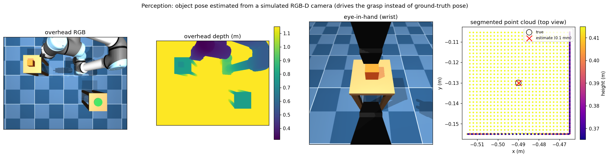
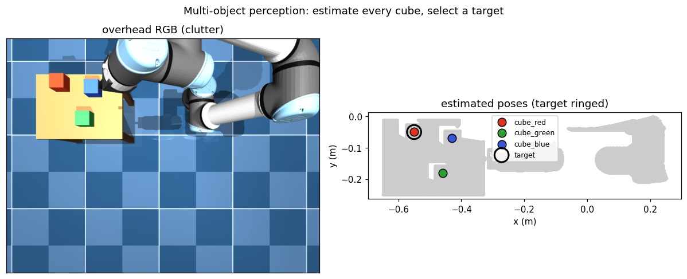

# Perception & vision

The lab can drive the arm from what a **simulated RGB-D camera sees** instead of
from privileged simulator state. A fixed overhead camera and an eye-in-hand
wrist camera render colour, metric depth, and segmentation; the depth is
deprojected into a world-frame point cloud, and an object's top-down grasp pose
is estimated from that cloud — no reading of `data.xpos`.



_Left: the scene. Right: the overhead camera the grasp is planned from; the red
marker is the perceived grasp point the arm closes on._



```python
from manipdyn.sim import World
from manipdyn.perception import Camera, sense_object_pose
from manipdyn.tasks import pick_place

world = World(scene="scene_pick", ee_site="pinch")
cam = Camera(world, "overhead")
est = sense_object_pose(cam)                    # ObjectEstimate from vision
plan = pick_place.solve(world, object_xy=est.top_xy)   # grasp what we see
```

## Pipeline

1. **Render** — `Camera` wraps a named `<camera>` and returns an `(H,W,3)` RGB
   image, an `(H,W)` metric **depth** image, and an `(H,W,2)` **segmentation**
   image, plus pinhole intrinsics `(fx, fy, cx, cy)` from `model.cam_fovy` and
   the camera-to-world extrinsics `(R, t)` from `data.cam_xpos/xmat`.
2. **Deproject** — each depth pixel becomes a metric camera-frame point and is
   transformed to the world frame:

   $$x=\frac{u-c_x}{f_x}\,z,\quad y=-\frac{v-c_y}{f_y}\,z,\quad p_\text{world}=R\,[x,\,y,\,-z]^\top+t.$$

   MuJoCo's depth is the linear perpendicular distance in metres along the
   optical axis (the camera looks down its local $-z$), so this standard pinhole
   model recovers world points. The convention is pinned by
   `tests/test_perception.py`.
3. **Clean** — voxel-downsample, drop the dominant plane (table/floor) with
   RANSAC, and keep the largest Euclidean cluster.
4. **Estimate** — `estimate_object_pose` returns the axis-aligned
   bounding-box centre, the top-surface height, footprint extents, and PCA
   axes. The **bounding-box centre** is a robust XY grasp target under a partial
   oblique view — its extremes are set by the object's edges, so it is not
   pulled toward the camera the way a raw centroid is by foreshortening.

## Two segmentation modes

`sense_object_pose(cam, segmentation=...)`:

* **`segmentation=True`** (default) uses MuJoCo's ground-truth segmentation
  buffer to pick the object's pixels — a stand-in for a perfect instance
  segmenter. It reads *which pixels are the object*, **never the object's
  pose**, so the grasp target still comes from geometry.
* **`segmentation=False`** is fully sensor-only: deproject everything, drop the
  table plane, and keep the largest cluster inside an optional workspace box
  (scene knowledge, not object pose). Cleaner when the arm is parked clear of
  the object; the ground-truth-segmentation mode is more robust to self-occlusion.

## Does vision cost anything?

`scripts/benchmark_perception.py` runs the full pick-and-place from the
ground-truth pose (oracle) and from the estimated pose (perception) over
randomized cube placements, on the same physics and the same success test, so
the cost of using vision instead of privileged state is measured directly:

| driver | grasp success | mean place err |
|--------|--------------:|---------------:|
| oracle (ground-truth pose) | 12/12 | 0.2 mm |
| **perception (RGB-D)** | 12/12 | 0.6 mm |

Perception pose error: mean **0.2 mm**, max **0.7 mm** with the arm parked clear
for the look. Numbers regenerate with `python scripts/benchmark_perception.py`.

## Multiple objects (clutter)

`sense_objects` returns an estimate for **every** object, not just one — the
basis for "find the right thing among clutter". On `scene_clutter` (three
coloured cubes) it recovers all three to sub-centimetre, and `select_object`
picks a target by `label` or by proximity (`near=`):

```python
from manipdyn.perception import Camera, sense_objects, select_object

cam = Camera(World(scene="scene_clutter", ee_site="pinch"), "overhead")
objs = sense_objects(cam)                       # one ObjectEstimate per cube
target = select_object(objs, label="cube_red")  # or near=some_xy
```

* **`segmentation=True`** estimates each movable (free-jointed) body separately.
* **`segmentation=False`** clusters the scene with no prior on the object count
  (`cluster_all`), so it finds however many blobs are on the table.



## Parametric scenes (domain randomization)

Clutter scenes don't have to be authored by hand. `build_clutter_scene` uses
`mujoco.MjSpec` to generate a UR5e + table + *N* randomly-placed cubes and
compile a model that `World` wraps directly — deterministic per seed, so every
seed is a fresh, reproducible layout:

```python
from manipdyn.sim import World
from manipdyn.models.procedural import build_clutter_scene

model = build_clutter_scene(n_cubes=4, seed=1)
world = World(model=model, ee_site="pinch")   # perception then finds all 4
```

This is the basis for domain randomization (a new layout every episode) and for
perception/RL over scenes nobody had to write MJCF for.

## What this does and doesn't do

* It replaces the **oracle object pose** with a *sensed* one — the grasp is
  driven by vision.
* It is independent of how the cube is held: the grasp can use a weld (default)
  or a real contact grasp (`use_weld=False`), described in [tasks](tasks.md).
* The two scene cameras are **non-physical** — no mass, DOF, or geometry — so
  adding them does not alter any existing dynamics, controller, or benchmark.
